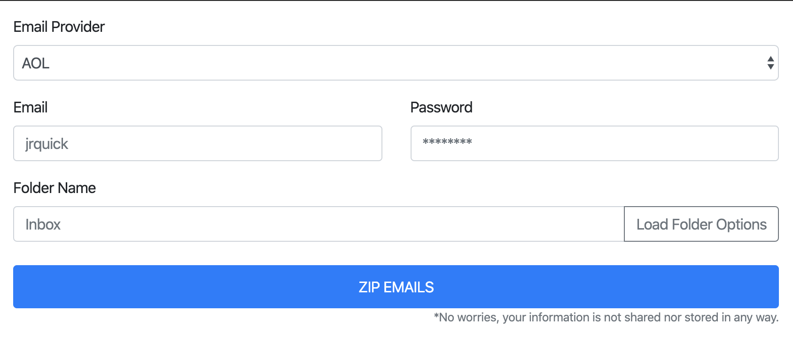

# zip-email #



## Index ##

* [About](#about)
* [Setup](#setup)
* [Contributing](#contributing)
* [Issues](#issues)

## About ## 

A simple PHP project for downloading all of your emails as a zip from either AOL, Gmail, Outlook, Yahoo, or even custom email providers.

* Try out [the demo](https://zip-email.jrquick.com) to see it in action!
* Visit [my website](https://jrquick.com) for other cool projects!

## Setup ##

* Install dependencies

```bash
npm install
```

## Contributing ##

To contribute, clone the repo. Then, run `npm install` to get the packages needed for the library to work. Running `gulp` will run a series of tasks that builds the files in `/src` into `/dist`. Replace the `/dist` into whatever Ionic application's `node_modules` where you're testing your changes to continuously improve the library.

### Thanks ###

* [jrquick17](https://github.com/jrquick17)

## Issues ##

If you find any issues feel free to open a request in [the Issues tab](https://github.com/jrquick17/zip-email/issues). If I have the time I will try to solve any issues but cannot make any guarantees. Feel free to contribute yourself.
